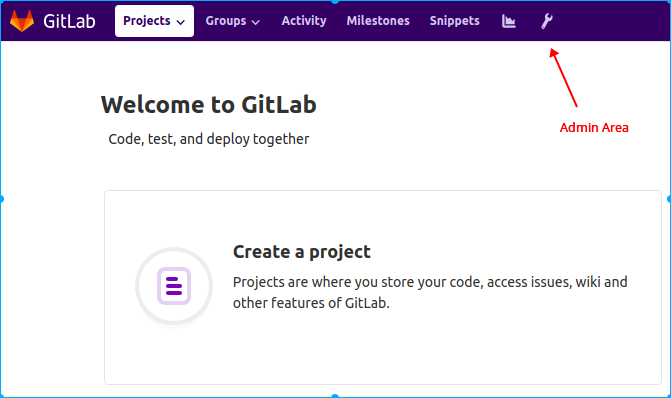
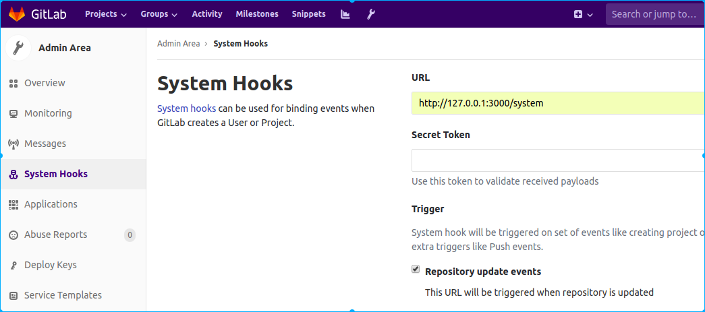
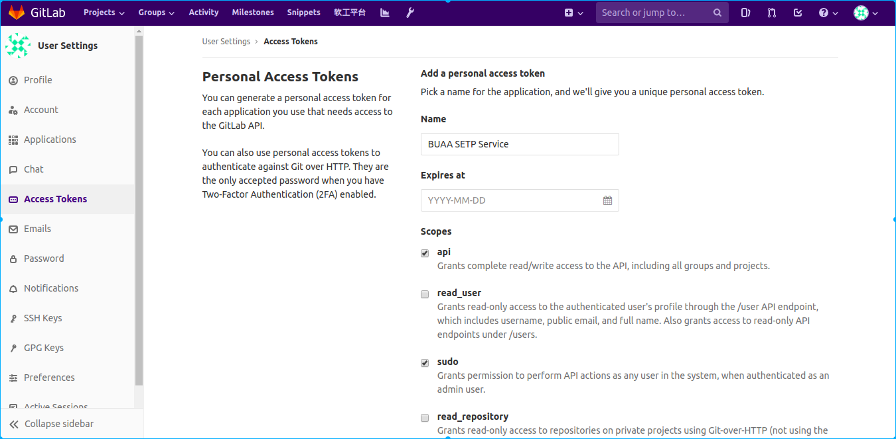
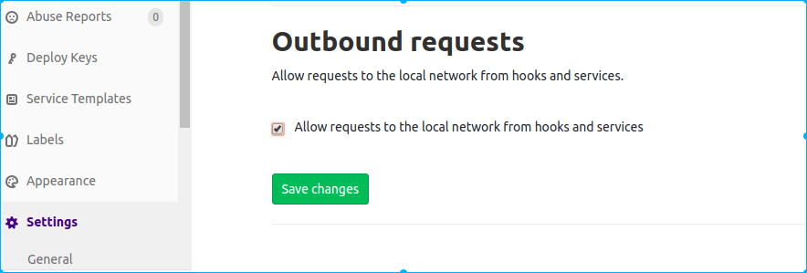
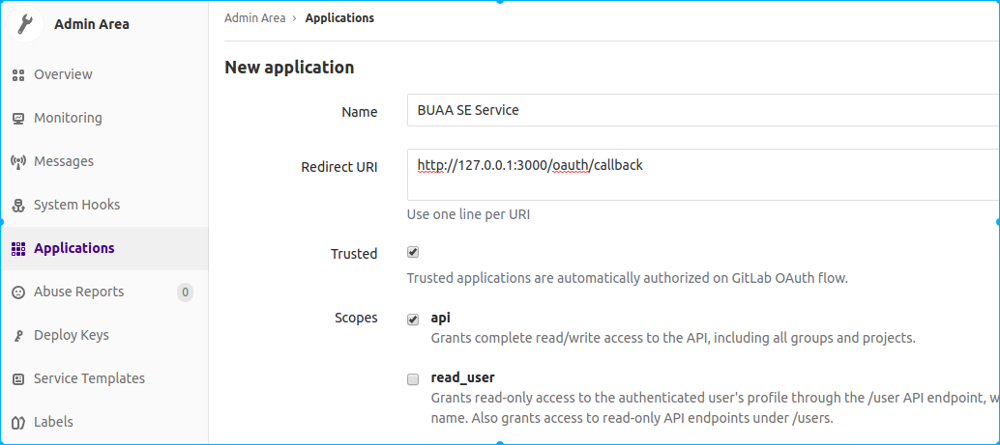

# 安装配置指南(Ubuntu14.04)

## Ruby 版本
  2.3+ (不要使用系统ruby版本，可以使用rvm安装)
## 依赖
### sshd
sshd 用于 git
```bash
sudo apt install openssh-server
```
### GitLab
安装GitLab
#### 安装依赖
```bash
sudo apt-get install -y curl ca-certificates
```
#### 添加GitLab仓库并安装
##### 官方源安装
添加仓库
```bash
curl -sS https://packages.gitlab.com/install/repositories/gitlab/gitlab-ce/script.deb.sh | sudo bash
```
安装，EXTERNAL_URL设置为GitLab实例Url
```bash
sudo EXTERNAL_URL="http://gitlab.ce" apt-get install gitlab-ce
```
##### 清华源安装
信任 GitLab 的 GPG 公钥:
```bash
curl https://packages.gitlab.com/gpg.key 2> /dev/null | sudo apt-key add - &>/dev/null
```
写入软件源， 编辑/etc/apt/sources.list.d/gitlab-ce.list，添加：
```bash
deb https://mirrors.tuna.tsinghua.edu.cn/gitlab-ce/ubuntu trusty main
```
更新软件源并安装
```bash
sudo apt update
sudo EXTERNAL_URL="http://gitlab.ce" apt-get install gitlab-ce
```
完成后打开 http://gitlab.ce 或 http://127.0.0.1 设置密码即可

## 配置
### GitLab配置
#### 配置 System Hook
* 以管理员账户登录GitLab，进入Admin Area

  
* 配置System Hook， 填写本服务Url，添加即可

  
#### 配置管理员 Access Token
进入root用户设置页，添加Access Token，务必勾选api和sudo


#### 允许添加 localhost webhook
进入Admin Area 设置页面，勾选 Allow requests to the local network from hooks and services


#### 添加 OAuth 应用
进入 Admin Area Applications 页面，添加应用，务必勾选api




### 本服务配置
配置GitLab地址和本服务地址，如：
```ruby
GitLabHost = 'http://gitlab.ce'.freeze
TeachHost = 'http://127.0.0.1:3000'.freeze
```
配置管理员Access Token，如：
```ruby
PRIVATE_TOKEN = 'yuppYSiMdMQn7A5MLX8z'.freeze
```
将上面配置 OAuth Application 得到的 Application ID，secret 和 Callback URL
写入配置文件，如：
```ruby
APP_ID = 'd0272f9ec2c0f63e3922b1d4484aad5b01189a718b1bb1a4bc0af91c6f9d262f'.freeze
APP_SECRET = '527da804ad9b6b2cb82afa63a2524fce1cc3a29ec95980e244787f941c6876ca'.freeze
REDIRECT_URI = "#{TeachHost}/oauth/callback".freeze
```

### GitLab Runners 配置
#### 安装 GitLab Runner
```bash
curl -L https://packages.gitlab.com/install/repositories/runner/gitlab-runner/script.deb.sh | sudo bash
sudo apt-get install gitlab-runner
```
#### 注册 GitLab Runner(Shared Runner)
参考 https://docs.gitlab.com/runner/register/index.html

### 数据库
+ 开发环境 Sqlite
+ 生产环境 PostgreSQL

### 部署
参考 [Rails + Webpacker + Puma + Nginx 部署](https://luocaodan.github.io/2019/01/01/Rails+Webpacker+Puma+Nginx_deploy/)

# GitLab 源码修改
## 导航栏
效果：


进入 GitLab 安装目录
```bash
cd /opt/gitlab/embedded/service/gitlab-rails/app/views/layouts/nav
```
添加文件 `_setp_link.html.haml`
```bash
sudo vi _setp_link.html.haml
```
粘贴下面代码
```haml
%li
  %a{title: 'Software Engineering Teach Platform', 'data-toggle': 'tooltip', href: 'http://10.2.28.170:3000', target: '_blank'} 软工平台
```
编辑该目录下的 `_dashboard.html.haml`，查找 
`= render_if_exists 'dashboard/operations/nav_link'`<br/>
在该行的上一行添加 `= render_if_exists 'layouts/nav/setp_link'`
示例：
```haml
...

= render_if_exists 'layouts/nav/setp_link'

= render_if_exists 'dashboard/operations/nav_link'
...
```
## WebHook
由于 GitLab WebHook 的限制，通过 WebHook 收集到的 Commit 信息每次 Push 不能超过 20 条，
导致可能收集不到全部的 Commit 信息，所以需要修改源码解除这一限制
编辑 `/opt/gitlab/embedded/service/gitlab-rails/lib/gitlab/data_builder/push.rb`
```bash
sudo vi /opt/gitlab/embedded/service/gitlab-rails/lib/gitlab/data_builder/push.rb
```
找到 `commits_limited = commits.last(20)`，注释该行，
添加 `commits_limited = commits`
示例：
```ruby
commits = Array(commits)

# Total commits count
commits_count ||= commits.size
 
# Get latest 20 commits ASC 
# commits_limited = commits.last(20)
commits_limited = commits
```
编辑 `/opt/gitlab/embedded/service/gitlab-rails/app/services/git_push_service.rb`
```bash
sudo vi /opt/gitlab/embedded/service/gitlab-rails/app/services/git_push_service.rb
```
找到 `PROCESS_COMMIT_LIMIT = 100`，修改为
```ruby
PROCESS_COMMIT_LIMIT = 2**31 -1
```
# issue 状态说明
状态有四种：
- `Open`
- `To Do`
- `Doing`
- `Closed`

其中 Open 包括To Do 和 Doing
所有新建Issue和重新打开的Issue状态初始为To Do
Issue 状态可在To Do, Doing, Closed 之间任意跳转
